# This was part of my cybersecurity course

## the goal is to find vulnerabilities and mistakes on this page :

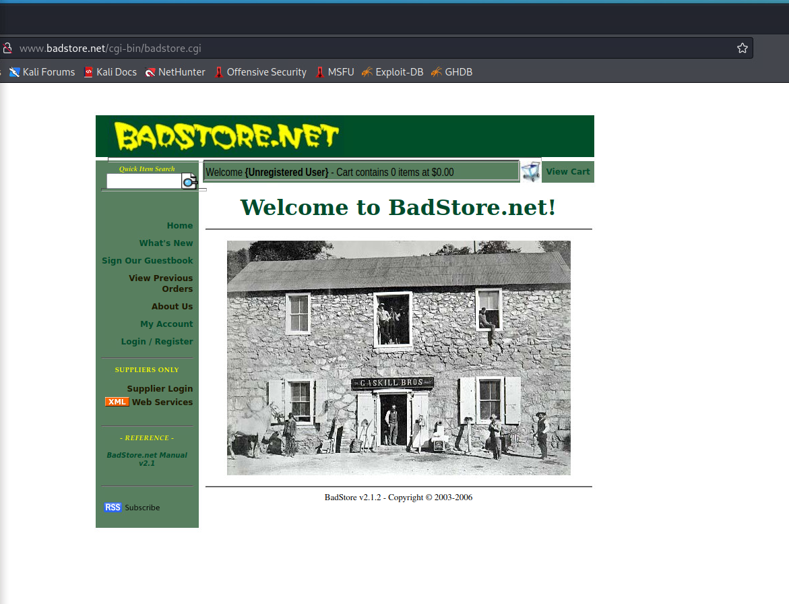

first nmapped to find open ports.

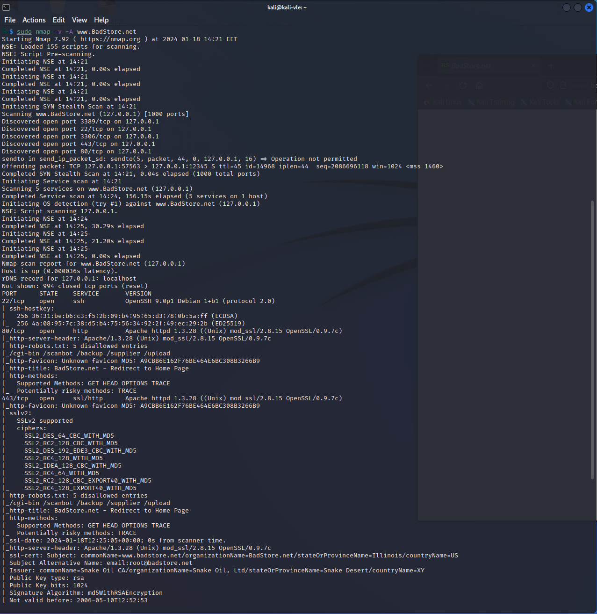

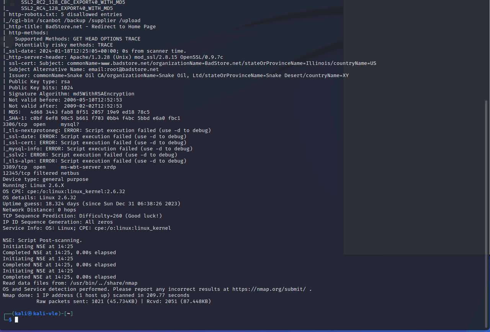

Found 5 open ports 

lets scan the web server with nikto.

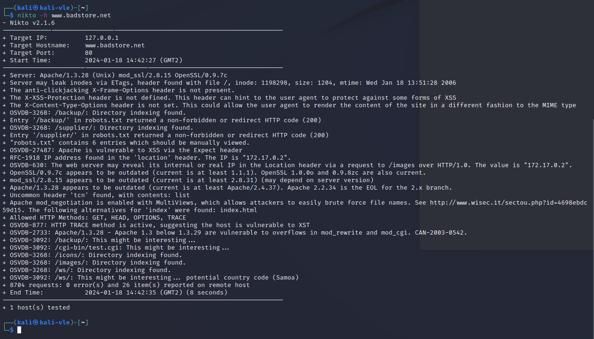

found multiple vulnerabilities 

also /backup and /suplier directories

found this in supplier directory :

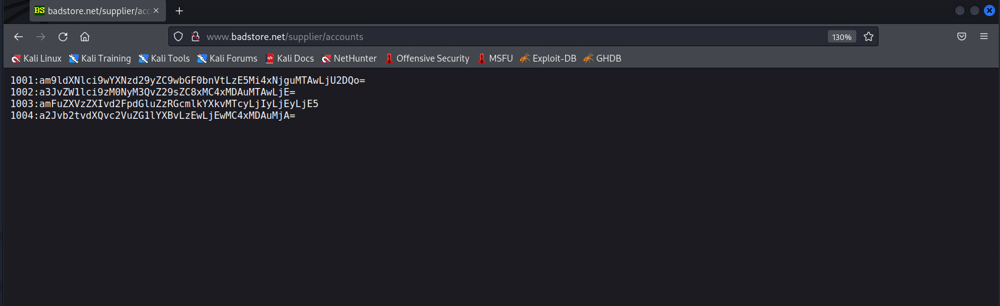

M5joeuser/password/platnum/192.168.100.56
M6kroemer/s3Cr3t/gold/10.100.100.1
M7janeuser/waiting4Friday/172.22.12.19
M8kbookout/sendmeapo/10.100.100.20

after decoding from Base64 format

earlier nmap showed us that there is a mysql service, lets try to connect

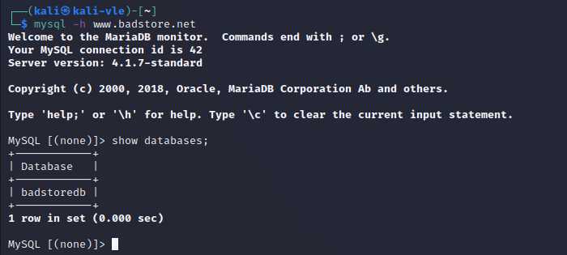

no password even :D

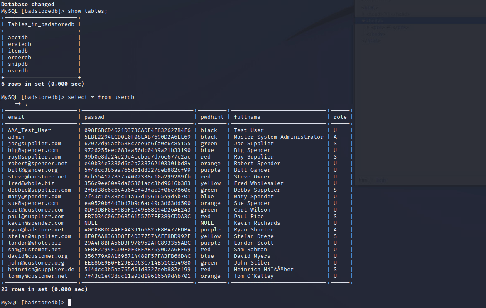

users with hashed passwords

tried to log in with 'or 1=1 or'
and got in as test user
tried admin'/* on log in and got in as admin :D

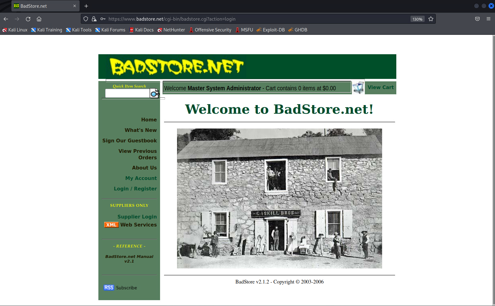

on admin meni we can perform different tasks like create backups 

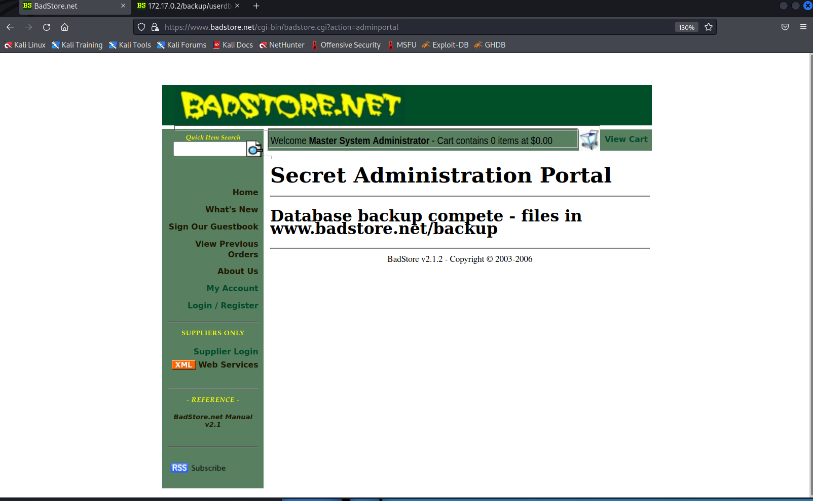

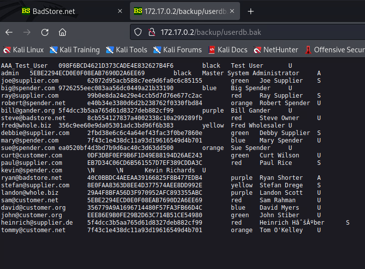

lets unhash the admins password now

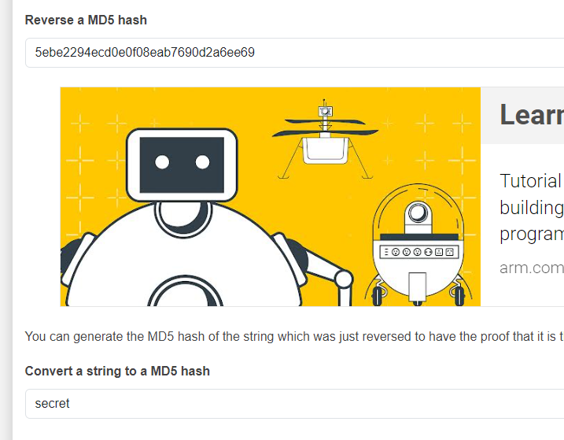

lets try to order something 

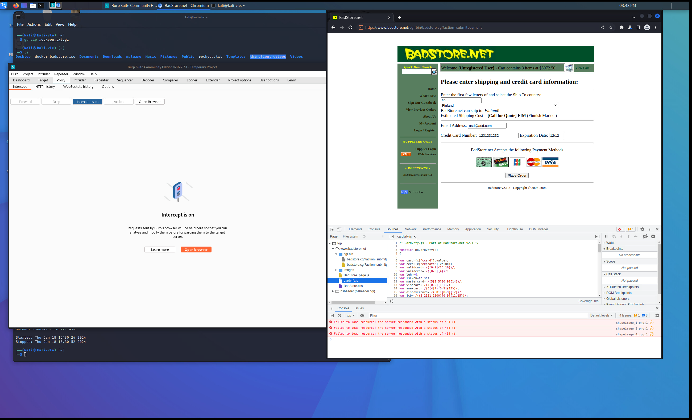

lets try to edit the card validation function

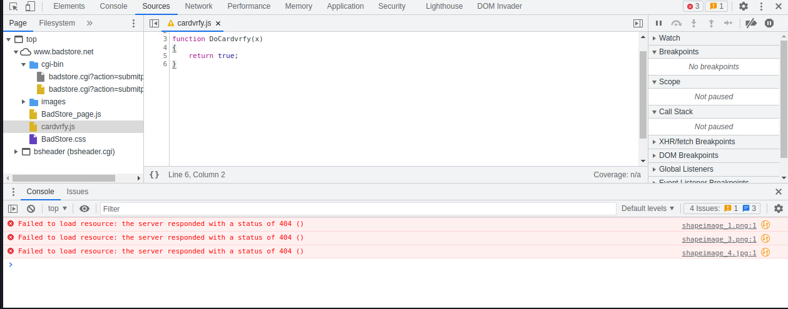

now lets intercept this with purbsuite while we press the order button:

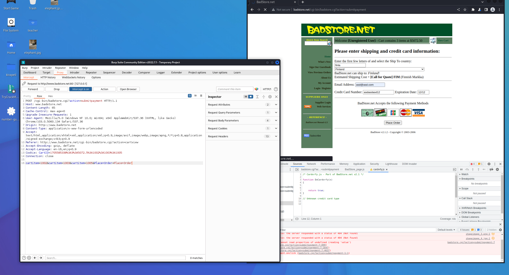

changed the price from 5000€ to 12,3

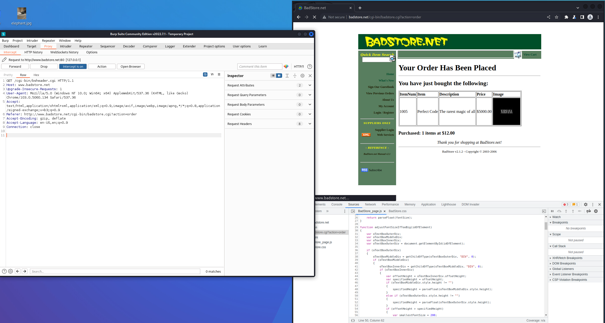

