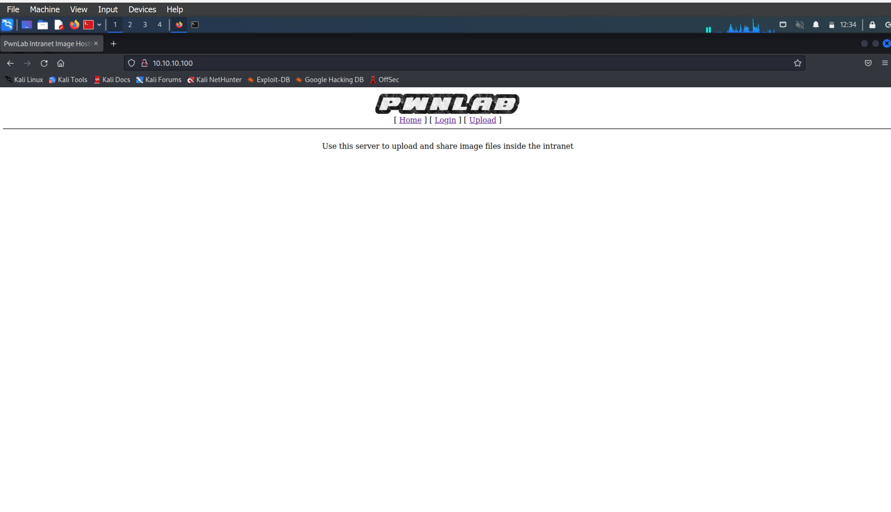
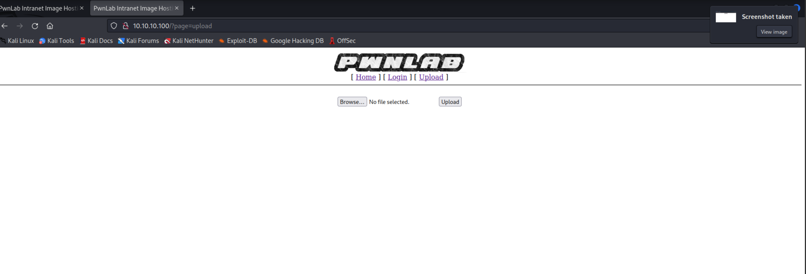
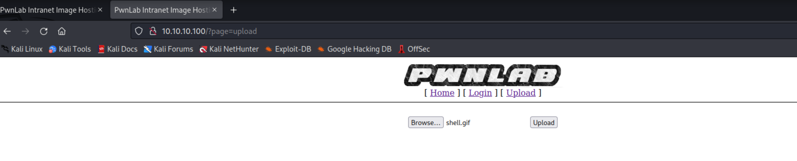
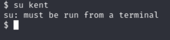

# Dokumentaatio haasteesta pwnlab

toteutettu Kali linux vm:llä sekä ladatulla kohde vm:llä virtualboxissa

etitty verkossa olevat osoitteet komennolla "sudo /usr/sbin/netdiscover"

nmapattu löytynyt ip

3 avonaista porttia.

80 portissa pyörii serveri. koska service http

käväistään selaimella http://"kohde ip":"portti"
tässä siis http://10.10.10.100:80

tarkistetaan nikto työkalulla haavoittuvaisuuksia.

walktroughsta kävin tässä lunttaamassa että miten pääsisi config.php tiedostoon käsiksi

http://10.10.10.100/?page=php://filter/convert.base64-encode/resource=config
tuommoiella urlilla se hakee base64 koodatun rimpsun tuolta php:stä ja kun tuon laittoi decoderiin niin sai

server = "localhost";
username = "root";
password = "H4u%QJ_H99";
database = "Users";

Mysql käyttäjä. kokeillaan kirjautua sisään

onnistui

Täältä löytyi kaks tablea, user ja pass.

3 käyttäjää ja heidän salasanansa suojattuina. syötetää decoderiin nuo

kent -- Sld6WHVCSkpOeQ== - JWzXuBJJNy

mike -- U0lmZHNURW42SQ== - SIfdsTEn6I

kane -- aVN2NVltMkdSbw== - iSv5Ym2GRo

Kirjauduttu kanella

ei juuri mitään erikoista.
Tehdään sama tuolle upload php:lle kuin aiemmin tehtiin configurelle:

decoderin jälkeen :

tämä ottaa vastaan vain jpg, jpeg,gif ja png tiedostoja

tuon kun laittoi decoderiin saatiin:

yritetän siis käynnistää shelli lähettämällä php reverse shell naamioituna jollekkin sallitulle formaatille. esim .gif

php tiedoston naamioiminen gifiksi. vaihdetaan pääte. gif ja lisätään ensimmäiselle riville GIF98

uploadataan tiedosto sivulle:

tiedosto näkyy nyt sourcessa:

Burpsuiten kanssa säheltämisessä meni kauan. en oikein hahmottanut sen käyttöä.

ongelma olikin php reverse shell tiedostossa, väärä ip.

kuunnellaan porttia joka asetettiin reverse shell tiedostoon:

¨
nyt purpsuite intercept selaimella tehty tuo tiedoston uploadaus sivulle:

vaihdettu cookieen lang=../"tiedostomme nimi"

saatiin reverse shelli käyntiin!

selvitetään kenellä ollaan kirjauduttu:

koitetaan vaihtaa käyttäjää jollekkin aiemmin selvitetyistä:

pitäisi siis saada terminaali auki.
googlailun jälkeen ilmeisesti pythonilla saa avattua esim näin:
python -c 'import pty;pty.spawn("/bin/bash")'

Toimi kuin junan vessa:

sitten selailin jonkin aikaa käyttäjien kotihakemistojen tiedostoja. viimein kanelta löytyi jotail poikkeavaa, tiedosto nimeltä msgmike

kun tiedoston ajaa:

tiedosto ajaa cat komennon

kokeillaan tehdä scripti joka käynnistää shellin, tällä kertaa miken käyttäjänä

nopean walktrough vilkaisun jälkeen ja sitten Path komennon googlailun jälkeen päätin kokeilla muuttaa tuota PATH:ia komennolla:

export PATH="/tmp:$PATH" (tmp koska tein tuon scriptin tmp kansioon)
sitten lisäsin pathin perään /home/kane
eli tämän hetkinen path:
/tmp/usr/local/sbin:/usr/local/bin:/usr/sbin:/usr/bin:/sbin:/bin:/usr/games

ei toiminut tällä kun yritti suorittaa msgmike tiedostoa

ei toiminut myöskään vaikka menin tmp kansioon, loin siellä cat tiedoston. ja muutin PATHIN "."

Onnistui kun teki suoraan kotihakemistoon "catin" ja muutti sen oikeudet 777 chmod:lla

vaihtoi pathin
.:/usr/local/bin:/usr/bin:/bin:/usr/local/games:/usr/games

ja ajoi tiedoston.

miken kotihakemistosta löytyi tiedosto msg2root.

kun ajoi tämän strings komennolla löytyi:

kun tiedoston ajaa se pyytää message for root:
ilmeisesti tämän kautta saa rootin ajamaan shellin jolloin :

noin. olemme rootilla

lippu löytyi

oli tosi vaikea ekaksi challengeksi.
mutta yllättävän montakohtaa sain "omatoimisesti" ilman walktroughn katsomista mutta piti kyllä monta kohtaa luntata, mutta yritin luntata sillein että saisin tietää mitä tehdä mutta en että miten se suoritetaan että saisi vähän itse etsiä tietoa.

Aikaa kului noin: 8h kahvitaukoineen ja tiedon etsimisineen

oli kivaa, aion ehdottomasti tehdä näitä lisää!

## OPITTUA

Opittu vähän purpsuitenkäyttöä, avoimien porttien löytämistä, sivuston heikkouksien etsimistä. LFI:n hyväksi käyttöä

### käytettyjä työkaluja

- purpsuite

- Nmap

- Nikto

löytyi myös kätevä LFI cheat sheet tähän alkuun:
https://highon.coffee/blog/lfi-cheat-sheet/

käytetyt walktrought:

https://reedphish.wordpress.com/2016/09/17/pwnlab-init-walkthrough/

https://n13mant.wordpress.com/2016/08/27/pwnlab-init/

muut sivut:
https://highon.coffee/blog/lfi-cheat-sheet/
https://hackmag.com/security/reach-the-root/
https://portswigger.net/burp/documentation/desktop/getting-started/reissuing-http-requests
https://phoenixnap.com/kb/linux-add-to-path
