### Sources:

- **CompTIA sec + study guide**
- [Professor messer](https://www.youtube.com/@professormesser)

# module 1

## 1.1 Security Controls

**Security risks**

- many categories and types

**Assets are also varied**

- data, physical property, computer systems
- Prevent security events, minimize impact, limit damage
- sec controls

### Control categories

**Tehcnical controls**

- controls implemented using systems
- operating system controls
- firewalls, anti-virus, etc software

**Managerial controls**

- administrative controls associated with sec design and implementation
- sec policies, standard operating preocedures

**Operational controls**

- controls implemented by people instead of systems
- sec guards, awareness programs

**Physical controls**

- limit physical access
- Giard shack
- fences, locks
- Badge readers

### Control categories and types

Think it like this:
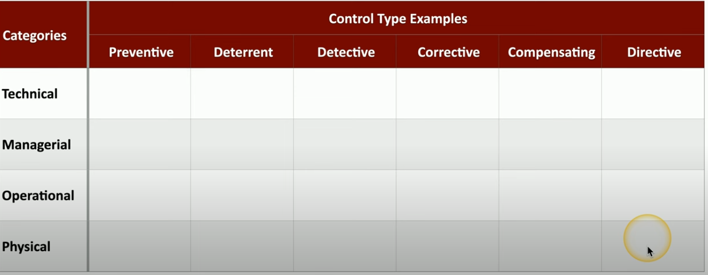

## Types

### Preventive control types

**Preventive**

- block access to aresource
- YOU SHALL NOT PASS

**Prevents access**

- firewall rules
- follow security policy
- guard shack checks all identification
- enable door locks

As you can see, some of these controls clearly go to a specific category. we later put them on the sheet earlied, so 1 control is under a category AND a type. for example:
**firewall rule ->**

- type : preventive
- category: technical

### Deterrent control types

**Deterrent**

- discourage any attempt to intrude
- does not directly prevent access

**Make and attacked think twice**

- application splash screns (category technilal, type deterrent)
- threat of demotion
- front reception desk
- warning signs

### Detective control types

**Detective**

- identify and log
- may not prevent access

**find the issue**

- collect and review system logs
- review login reports
- regularly patrol the property ( category: operational because requires human )
- enable motion detectors

## Corrective control types

**corrective**

- apply a control after an event
- reverse the impact ? -
- continue operating with min downtime

**Correct the problem**

- restore from backups can mitigate a ransomware infection
- create policies for reporting sec issues (managerial)
- contact law enforcement to manage criminal activity (operational)
- use a fire extinguisther (physical)

## Compensating control types

**Compensating**

- control using other means
- existing conrtols arent sufficient
- maybe be temporary
- as the type name says, compensates some weakness?

**prevent the exploitation of a weakness**

- firewall blocks a spcecific application instead of patching the app
- implement a seperation of duties
- require simultaneous guead duties
- generator used after power outage

## Directive control types

**directive**

- direct a subject towards security complioance
- a relatively weak sec control

**do this, please**

- store all sensitive files in a protected folder
- create compliance policies and procedures
- train users on proper sec policy
- post a sign for "authorized personnel only"

## all types and examples of type controls, under their type and category

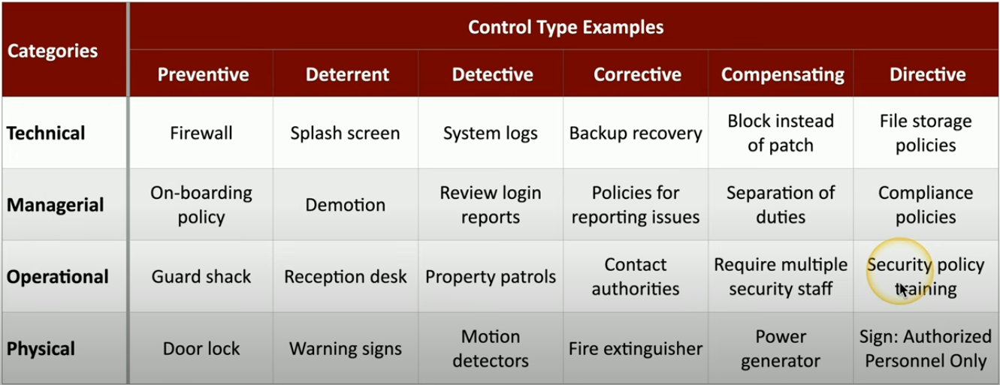

## Managing security controls

**no inclusive lists**

- there are many categories of control
- some organizations will combine types

**Multiple sec controls for each category and type**

- some controls may be in multiple types or categories

---

## 1.2 THE CIA Triad

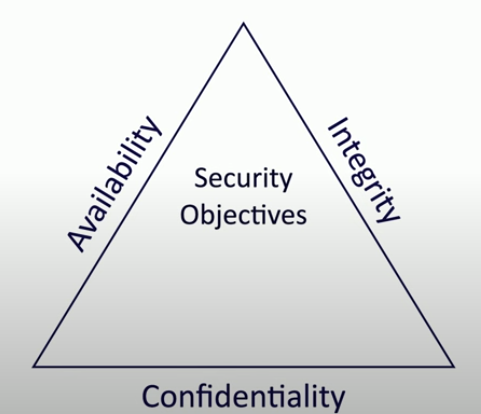

**combination of principles**

- fundamentals of security
- sometimes AIC

**Confidentiality**

- prevent disclosure of information to unauthorized individuals or systems
- **Encryption**
  - Encode messages so only certain people can read
- **Access controls**
  - selective resrict access to a resource
- **2-factor authentication**
  - additional confirmation becofe info is disclosed

**Integrity**

- **the message/information is stored and transferred as intended**
  - modifications would be detected
- **Hashing**
  - map data of an arbitrary lenght to a data of a fixed length
- **Digital signarture**
  - takes a hash and encrypts it
  - mathematical scheme to verify the integrity
- **certificates**
  - combine with a digital signature to verify individual
- **Non-repudiation**
  - provides proof of integrity, can be asserted to be genuine

**Availability**

- systems and networks must be up and running
- **Information is accessible to authorized users**

- **redundancy**
  - build a service that will always be available
- **Fault tolerance**
  - system will continue to run even on a failure
- **Patching**
  - stability
  - close security holes

---

## 1.2 Non-repudiation (Integrity)

**You cant deny what you've said**

- signt a contract
  - your signature adds non-repudiation
  - you really did sigh the contract
  - others can see your signature

### Proof of integrity

**verify data does not change** - data remains accurate and consistent
**In cryptography, we use hash** - represent data as a short string of text - message digest, a "fingerprint of the message"

**If the data changes, the hash changes** - only tells you if the data has changed

### Hashing

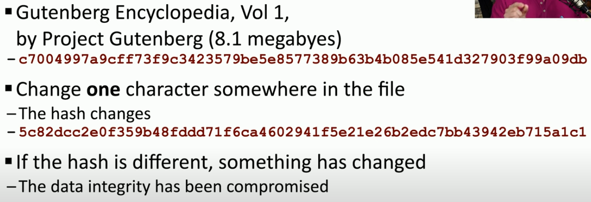

### Proof of origin

**Prove the message has not changed** - integrity
**Prove the source of the mssage** - Authentication
**Make sure the signature isnt fake** - Non repudiation
**Sign with the private key** - message doesnt need to be encrypted - nobody else can sign this
**Verify with the public key** - Any change to the essage will invalidate the signature

## Creating a digital signature

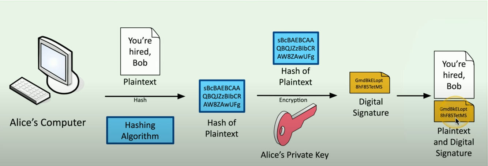

## Verifying a digital signature

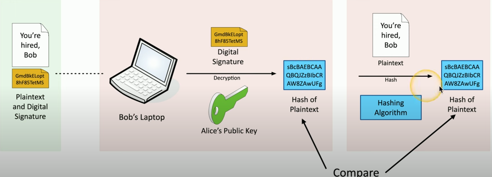

---

## 1.2 AAA Framework

- **Authentication**
  - prove who you are
  - pass wd and other auth
- **Ahuthorization**
  - what access do you have based on your identification and authentication
- **Accounting**
  - logging stuff like login time, data sent and received and logout time

pretty good demostration :
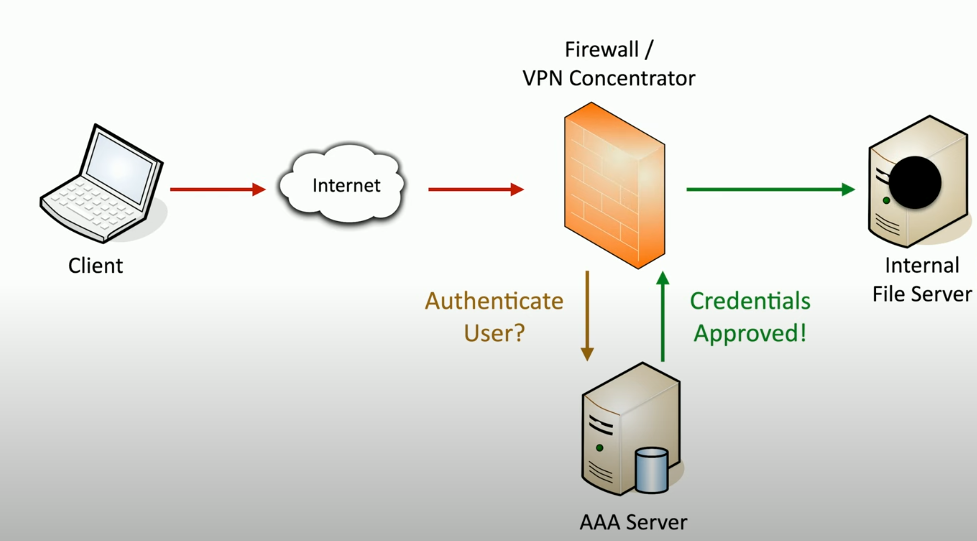

### Authenticating sustems

- Signed certificate on the device

**Other buysiness processes rely on the cert**

- access to the VPN from authorized devices
- Management software can validate the end device

## Certifivate authentication

### Organization has a trusted Certificate Authority (CA)

- **The organization creates a cert for a device**
- and digitally signs the cert with organizations CA

-**The cert can now be included on a device as and authentication factor**

- The CA's digital signature is used to calidate the certificate
- now when checking the certifcate on device we can be sure that it is signed by organizations CA

### Authorization models

#### when user/device is authentizated

- what access?
- time to apply and authorization model

**Users and services -> data and apps**

- associating individual users to access rights does not scale

**Put and authorization mnodel in the middle**

- define by Roles, organizations, attributes etc..

### When there is no authorization model

Does not scale well, when 1 person needs permission to multiple areas, for example create a shippoing laber, tracking and view shipment reports.
you can easily give these permission for 1 person, but when theres lets say 20 employees who need these permissions, adding them one by one takes alot of time and effort.

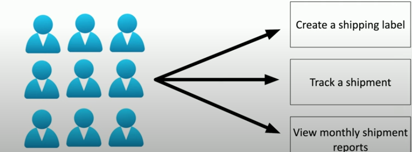

### When there is authorization model

- reduce complexity
- create a clear relationshipo between the user and the resource

**Administration is streamlined**

- easy to understand the authorizations
- Supports any number of users or resources

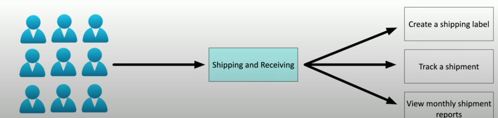

---

## 1.2 Gap Analysis

### Where we are, where you want to be comparison

- the gap between those 2

### May require alot research

- might take weeks or months
- alot of emails, data gathering and technical research

**Choosing the frameworkÄ**

- **Work towards a known baseline**
  - May be an internal set of goals
  - some organizations should use forman standards
- **Determine the end goal**
  - For example if companuy is following NIST(National institution of standards in technology)
  - ISO(international organization for standartisation)/IEC(Internationa electrotechnical Comission)
    - information security management systems
  - or define own end goals

### Evaluate people and processes

- **Get a baseline of employees**
  - Formal experience
  - Current training
  - knowledge of security policies and procedures
- **Examine the current processes**
  - research existing IT systems
  - Evaluate existing sec policies

### Compare and contrast

- **Comparison**

- **Identify weaknesses**

- **a detailed analysis**

### The analysis and report

- **The final Comparison**
  - detailet baseline objectives
  - a clear view of the current state
- **Need a path to get from current to the goal**

  - will almost certainly include time, money and lot s of change control

- **Create the gap analysis report**
  - formal description of current state
  - recommendendations for meeting the baseline

### Example of gap analysis overview

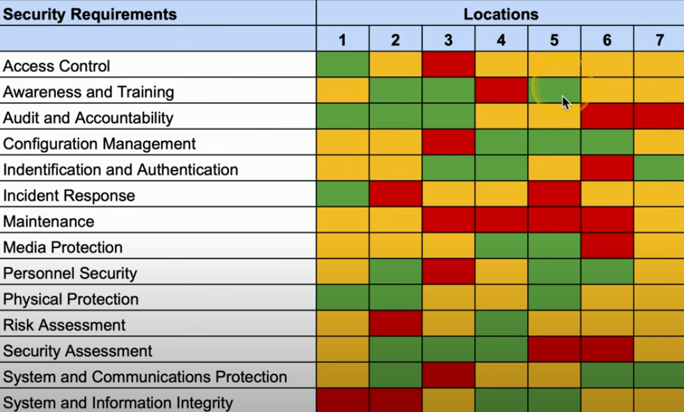

---

## 1.2 Zero Trust

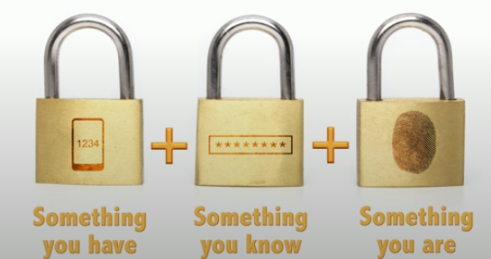

Many networks are relatively open on the insice
once trough firewall, very few sec controls

Zero trust -> holistic approach to network sec
covers every device, process and person
authenticate everytime you want to access something

everything is verified
MFA(Multi-factor authentication), Encryption, system permissions, additional firewalls, monitoring and analytics etc.

### Planes of operation

split the network into functional planes

**data plane**

- process the frames, packers and network data
- processing fdorwarding,m trunking, encrupting, NAT

**control plane**

- manages the actions of dsaata plane
- define policies and rules
- detremines how poackets should be forwarded
- routing tables, sesion tables, NAT tables

example on a switch

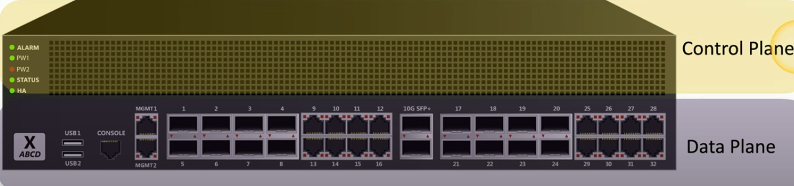

### Controlling trust

**adaptive identity**

- consider the source and requested resources
- multiple risk indicators, relationship to the organization, physical location type of connection ip adress, etc

**-> make the authentication stronger if needed**

**Threat scope reduction**

- decrease the number of possible entry points
- for example only people inside the building or conencted via VPn

### policy driven access-control

**Security Zones**

\*Where from and where to\*\*

- trusted, untrusted
- internal- or external network
- vpn1, vpn 5, vpn 11
- marketing, it, accounting, HR

**using zones may be enought to deny access**
for example untrusted to trusted zone traffic

some zones are impolicitly trusted
for example truster to internal zone traffic

### Policy enforcement point

**Subjects and systems**

- end users, applications ,non-jh8uman entities

**Policy enforcement point (PEP)**

- the gatekeeper

  **Allow, monitor and terminate connections**

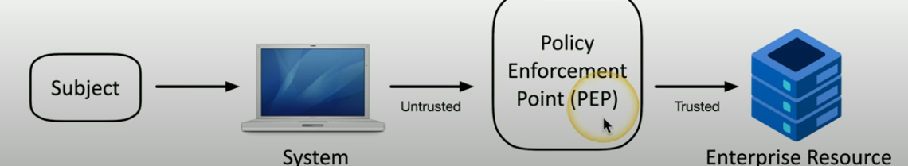

## Applying trust in the planes

**Policy decision Point**

- theres a process for making an auth decision

**PÅPolicy engine**

- evaluates each access deciusion vased on policy and other info souyrses
- grand, deny or revoke

**Policy admin**

- Communicates with the PEP
- Generates access tokens or credentials
- Tells the PEP to allwo or disallow access

### Zero trust across planes

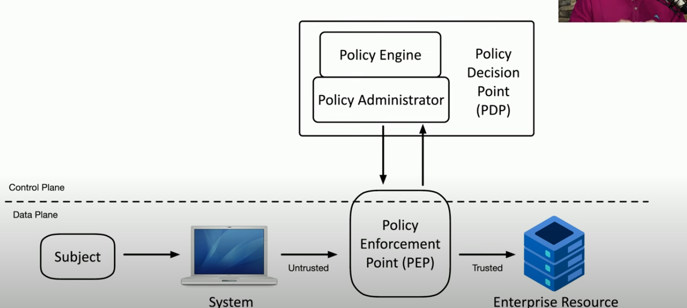

---

## Physical security 1.2

### Barricades /bollards

**Prevent access**

**Channel people trgogh a specific access point**

**Indetify safety concerns**

**Can be used to an extreme**

### Access control vestibules

**All doors normalyl unlocked**

- opening one door causes others to lock

**All dors normally locked**

- unlocking one3 door prevents otherts from unlocking

**One door open / other locked**

- when one is open, the other cannot be unlocked

**One at a time, controlled groups**

- managed control trough an area

### Fencing

pretty self explaintory, can be transparent or opaque, should be robust
on more secured areas prevent climbing with razor wire/make it higher or both

### Video surveillance

**CCTV( closed circuit television)**

- can replace physical guards

**Features important**

- Motion recognition can alarm/alert when something moves
- Object detection can identifyu license plates or faces

**Often many different cameras**

- networged together and records data to 1 single storage point

**Security guard**

- physical protection at specified area
- validates identification of employees
  **Two person integrity/control**
- minimazer exposure to an attack
- no signe person has access to a physical asset

**Access badge**

- picture, name , other details
- must be worn at all times
- electronically logged, can badge into a room and movement to areas can be logged

## Lighting 