# Notes relevant to SOC tier 1 role

# Intro

**Some common vocabulary**

- C2 = Command and Control Infrastructure
- SIEM = Security information and event management
- TTP = Tactics, techniques and procedures
- IDS = Intrusion Detection System
- EDR = Endpoint Detection and Response
- IOC = Indicators of Compromise
- CVE = Common Vulnerabilities and Exposures
- APTs = Advanced Persistent Threats
- RATs - Remote Access Tools
- MITRE ATT&CK® = knowledge base of adversary tactics and techniques based on real-world scenarios
- UKC = Unified kill chain
- MITM = Man in the middle

## Responsibilities

- Monitor and investigate alerts
- conf and manage sec tools
- develop and implement basic IDS (Intrusion Detection System) signatures
- Participate in SOC working groups, meetings
- create tickets and escalater the sec incidents to tier 2 and if needed Team Lead

SOC tied model overview:
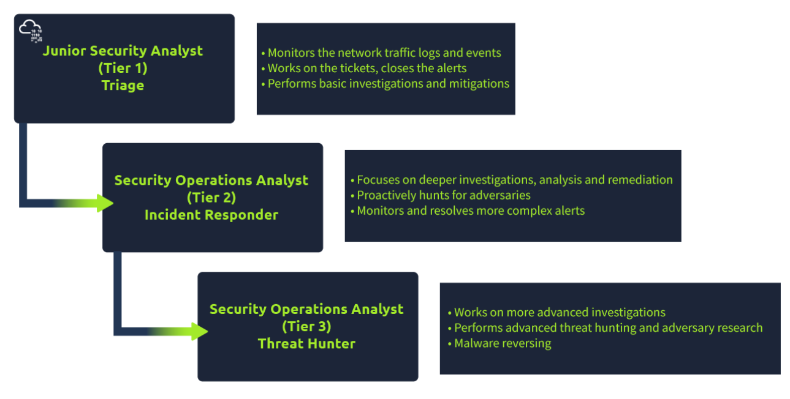

SOC investigates, monitors, prevents and responds to threats

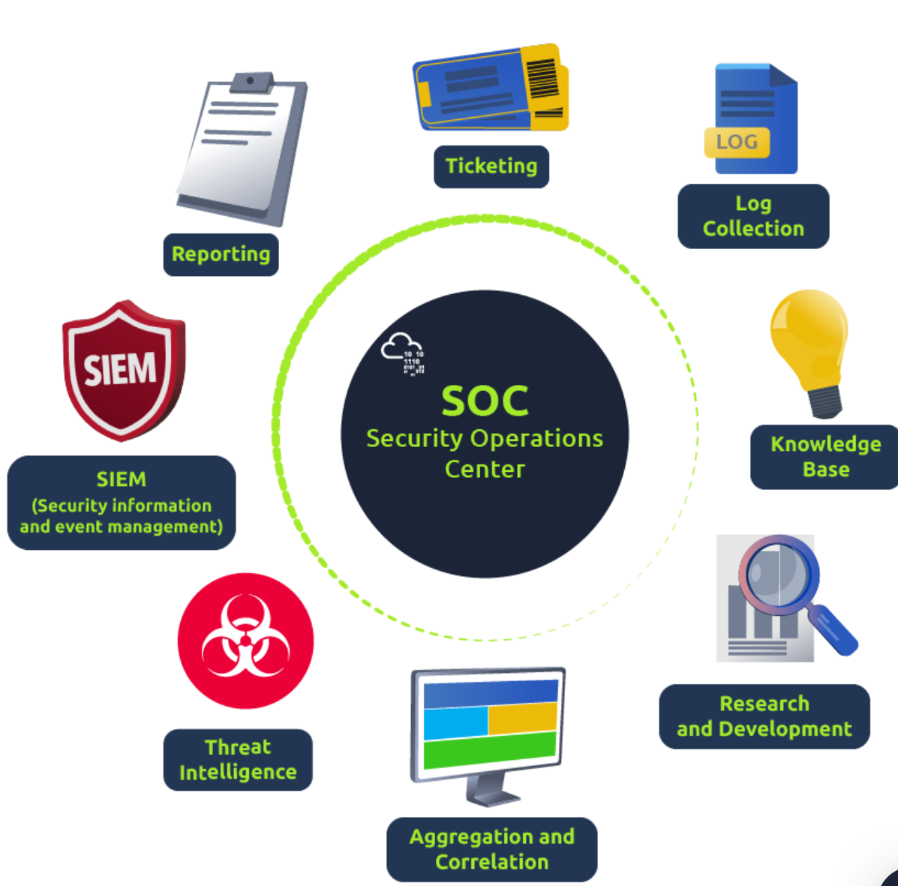

**prevention methods** - gather data on threats, threat actors and their TTPs(Tactics, techniques and procedures) - Maintenance procedures: - updating firewall signatures - patching vulnerabilitie - block-listing/safe-listing applications, email addresses and IPs

**Monitoring and investigating** - SIEM(Security information and event management) - EDR (Endpoint Detection and Response) - integrated endpoint security solutions - monitors and collects endpoint data with rules-based automated response and analysis capabilitises - analyze data to identify threat patterns - Forensics and analysis tools to research identified threats and search for suspicious activities

**Response** - after investigating, SOC team coordinates and takes action on compromised hosts - isolating hosts from network - terminating malicious processes - deleting files - and more

### Tutorial 1

first tutorial from SOC path in tryhackme

firts goal is to detect the suspicious activity wich is clearly the unauthorized connection from IP: 221.181.185.159 to Port 22

we check the reputation of a ip address

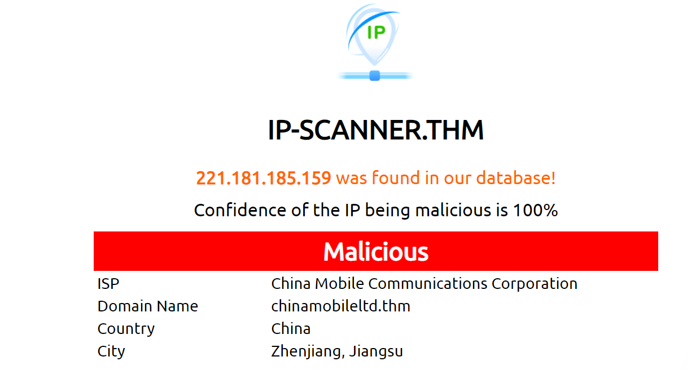

ip seems to be mmalicious
next we ecalate it, as we noticed on the first part that it succesfully authenticated

**we escalate it to SOC team lead and got permission to block the ip address**

we add the ip to firewall blocklist and the first tutorial is completed

# Pyramid of pain

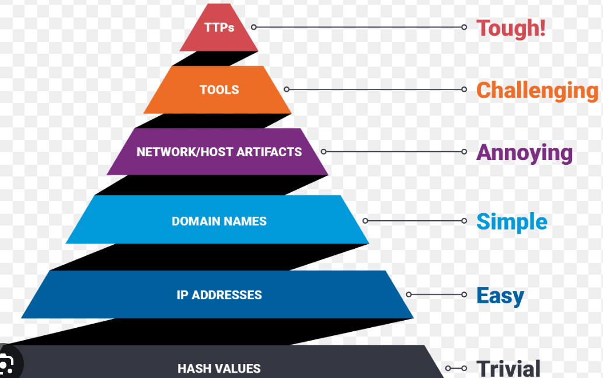

## Hash values

**Numeric value or a fixed length that uniquely identifies data** - result of a hashing algorithm

**MD5**
-NOT considered secure - 128-bit hash
**Sha-1(Secure Hash Algorithm 1)**

- 160-but hash
- 40 digit hexadecimal number
- Banned 2013 due its susceptivle to brute-force attacks
  **SHA-2**
- Many variants, most common is SHA-256
  - SHA-256 returns a hash value of 256-bits as a 64 digit hexadecimal number

A hash is not considered to be cryptographically secure if two files have the same hash value or digest.

security professionals usually use hash values to gain insights into a specif malware sample, a malicious or a suspicious file and as a wayt o identify and reference the malicious artifact.

researchers provide these hashed related to the malicious or suspicious files at the end of reports.

there a re many online tools to do hash lookups
[VirusTotal](https://www.virustotal.com/gui/)
[Metadefender Cloud- OPSWAT](https://metadefender.opswat.com/)

example:
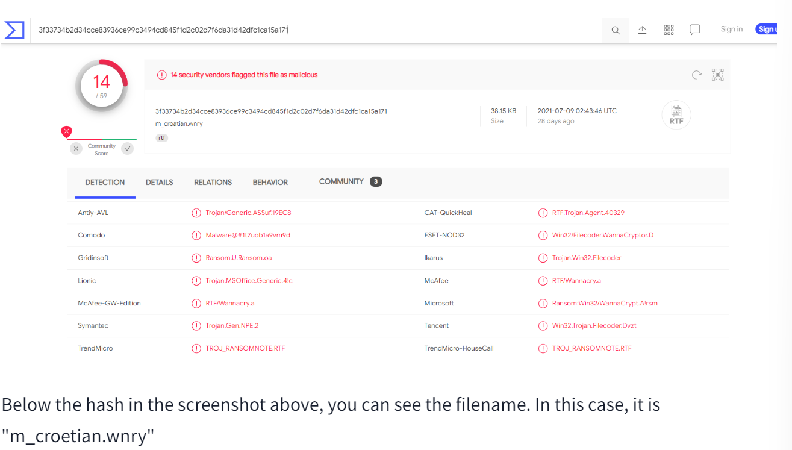

With so many variations and instances of known malware or ransomware, threat hunting using file hashes as the IOC (Indicators of Compromise) can become difficult.

## IP Address

In pyramid of pain, ip addresses are indicated twith the color green

Most common defense tactic is to block, drop or deny inbound requests from IP addresses on your parameter or external firewall

- this is not very bulletproof, as its pretty easy for experienced adversary to gain a new public IP address

**Fast Flux**

- a DNS technique used by botnets to hide phishing, web proxying, malware delivery and malware communication activities behind compromised hosts acting as proxies.
- goal is to make communication between malware and its command and control server ahrd to discover.

#### Task

read a report and find asnwers to questions.
Malware analysis on file some_malicious_file.bin

Read the following report to answer this question. What is the first IP address the malicious process (PID 1632) attempts to communicate with?

Read the following report to answer this question. What is the first domain name the malicious process (PID 1632) attempts to communicate with?

Answers found on connections section of the report

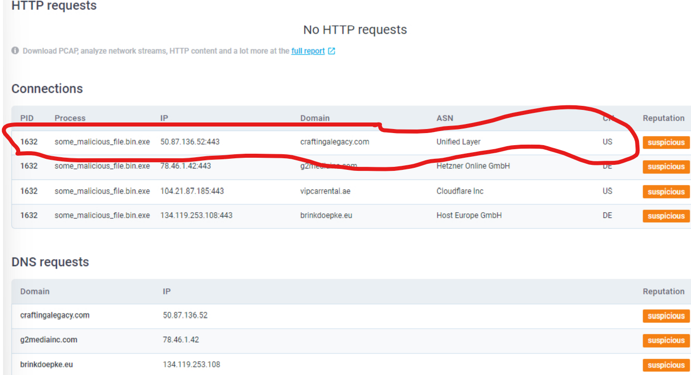

## Domain Names

Domain Names can be thought as simply mapping an IP address to a string of text. A domain name can contain a domain and a top-level domain (evilcorp.com) or a sub-domain followed by a domain and top-level domain (tryhackme.evilcorp.com)

Many DNS providers have loose standards and provide APIs to make it easier for attackers to change domains

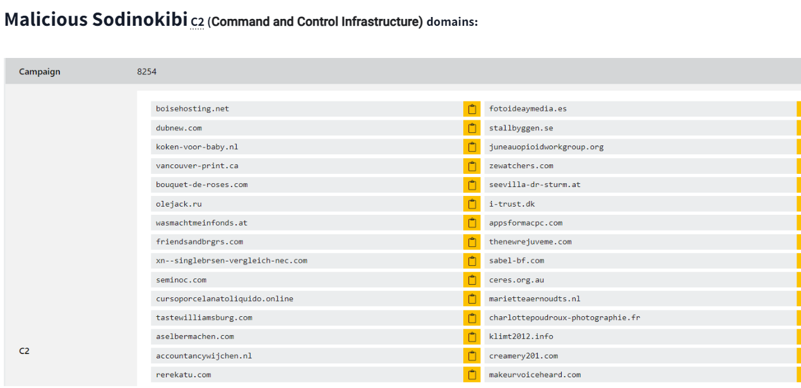

**PunyCode**

Punycode is a way of converting words that cannot be written in ASCII, into a Unicode ASCII encoding.

Url shorteners are used by attackeds to hide the macicious domains. It creates a short and unique URL that will redirect to the specific website specified during setting up the URL shortener link. Here are some URL shortening services used to generate malicious links:

- bit.ly
- goo.gl
- ow.ly
- s.id
- smarturl.it
- tiny.pl
- tinyurl.com
- x.co

You can see the actual website the shortened link is redirecting you to by appending "+" to it

so punycode attack uses unicode characters in the domain name to imitate a known domain

## Host Artifacts

Host artifacts are the traces or observables that attackers leave on the system, such as registry values, suspicious process execution, attack patterns or IOCs (Indicators of Compromise), files dropped by malicious applications, or anything exclusive to the current threat.

### Task

in this task we review a report from security vendors analysis on malicious sample

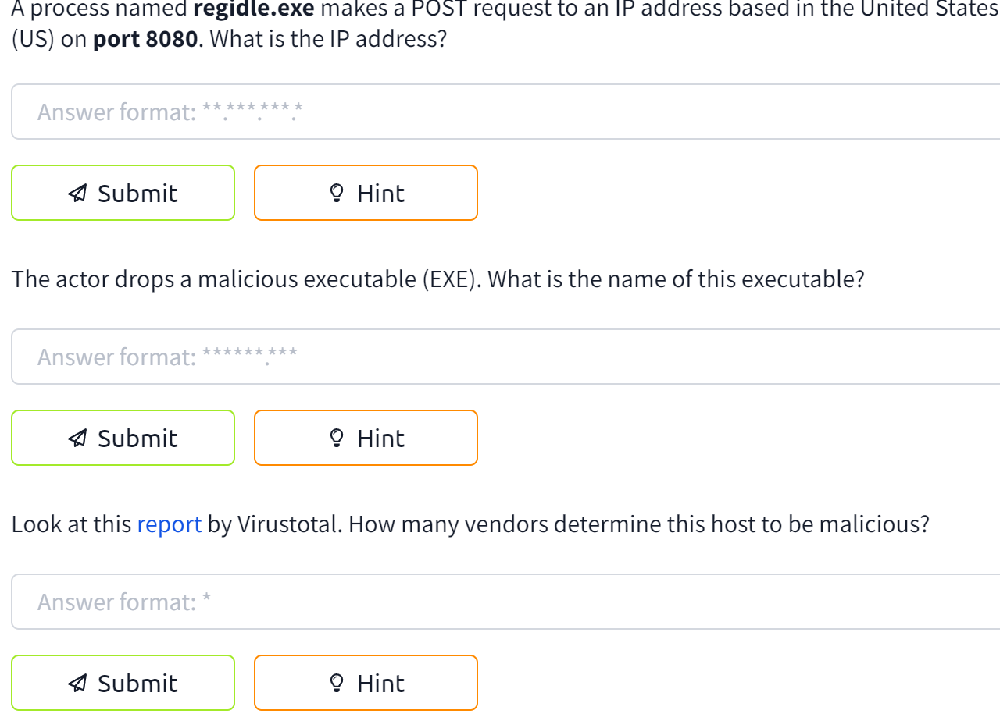

1:
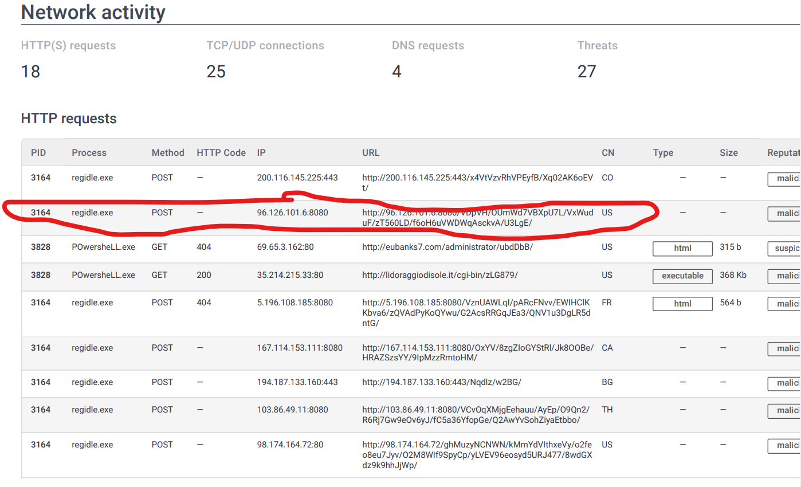

2:
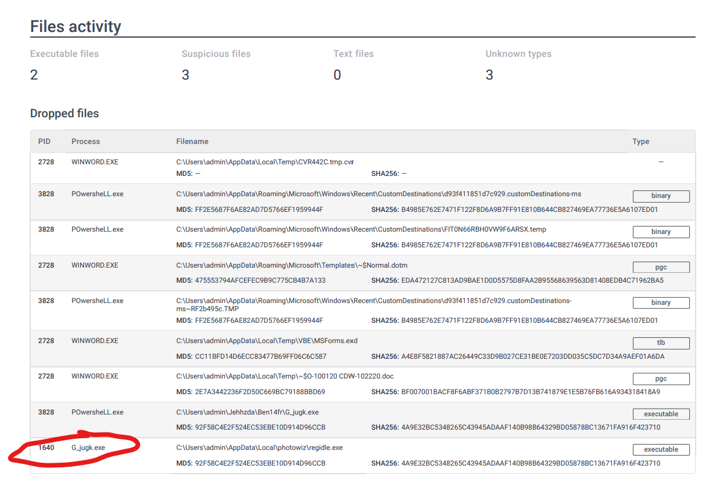

3:

## Network Artifacts

A network artifact can be a user-agent string, C2 information, or URI patterns followed by the HTTP POST requests.An attacker might use a User-Agent string that hasn’t been observed in your environment before or seems out of the ordinary. The User-Agent is defined by RFC2616 as the request-header field that contains the information about the user agent originating the request.

Network artifacts can be detected in Wireshark PCAPs (file that contains the packet data of a network) by using a network protocol analyzer such as TShark or exploring IDS (Intrusion Detection System) logging from a source such as Snort.

## Tools

attackers use macro documents (maldocs) for spearphishing attempts, a backdoor that can be used to establish C2 (Command and Control Infrastructure), any custom .EXE, and .DLL files, payloads, or password crackers.

Antivirus signatures, detection rules, and YARA rules can be great weapons for you to use against attackers at this stage.

MalwareBazaar and Malshare are good resources.

- provice access to samples
- malicious feeds
- YARA results

**detection rules**

- SOC Prime Threat DEtection Marketplace is a good platform for detection rules for different kinds of threats, including latest CVE's

**Fuzzy Hashing / context triggered piecewise hashes**

- helps to perform similarity analysis
- match two files with minor differences based on the fuzzy hash values.
- complete explanation : https://ssdeep-project.github.io/ssdeep/index.html

## TTPs

**Tactics, techniques and procedures**

includes MITRE ATT&CK matrix:
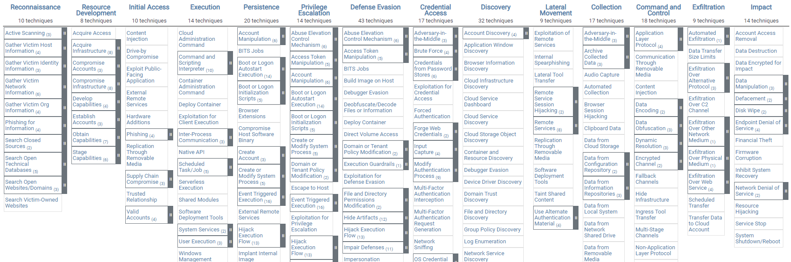

# Cyber Kill Chain

The framework defines the steps used by adversaries or malicious actors in cyberspace
You can use the Cyber Kill Chain to assess your network and system security by identifying missing security controls and closing certain security gaps based on your company's infrastructure.

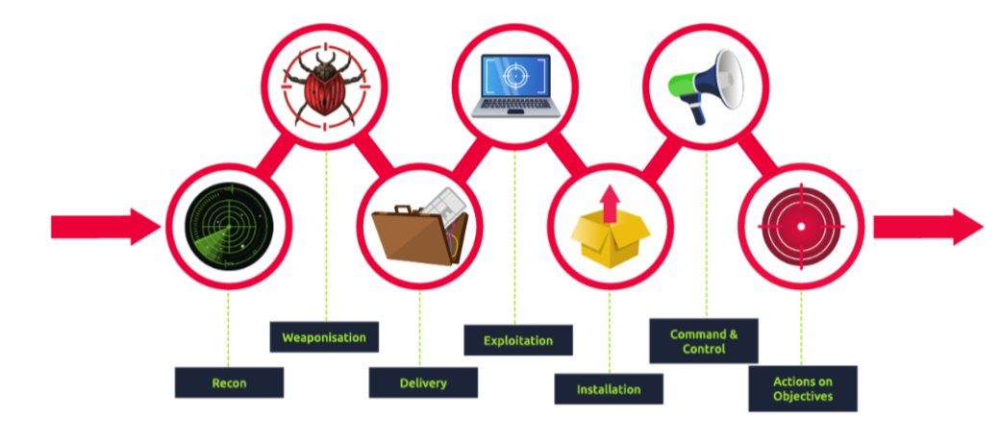

## Recon/reconnaisance

**discovering and collecting information on the system and the victim**

**OSINT(Open-source-intelligence)**

- also falls under recon
- study the victim by collecting every available piece of information
  - company size
  - email addresses
  - phone numbers
- you can find ALOT of information just by googling

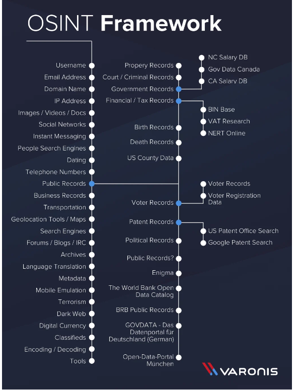

**email harvesting**

- process to obtain email addresses from public, paid or free services

some recon tools:

- TheHarvester other than gathering emails, this tool is also capable of gathering names, subdomains, IPs, and URLs using multiple public data sources
- Hunter.io - this is an email hunting tool that will let you obtain contact information associated with the domain
- OSINT Framework - OSINT Framework provides the collection of OSINT tools based on various categories

An attacker would also use social media websites such as LinkedIn, Facebook, Twitter, and Instagram to collect information on a specific victim he would want to attack or the company. The information found on social media can be beneficial for an attacker to conduct a phishing attack.

## Weaponization

Malware is a program or software that is designed to damage, disrupt, or gain unauthorized access to a computer.

An exploit is a program or a code that takes advantage of the vulnerability or flaw in the application or system.

A payload is a malicious code that the attacker runs on the system

In the Weaponization phase, the attacker would:

Create an infected Microsoft Office document containing a malicious macro or VBA (Visual Basic for Applications) scripts. If you want to learn about macro and VBA, please refer to the article "Intro to Macros and VBA For Script Kiddies" by TrustedSec.

An attacker can create a malicious payload or a very sophisticated worm, implant it on the USB drives, and then distribute them in public. An example of the virus.

An attacker would choose Command and Control (C2) techniques for executing the commands on the victim's machine or deliver more payloads. You can read more about the C2 techniques on MITRE ATT&CK.

An attacker would select a backdoor implant (the way to access the computer system, which includes bypassing the security mechanisms).

## Delivery

**delivery phase is when attacked choses the method for transmitting the payload or the malware**

### some options for delivery

**Phishing email:**
after conducting the reconnaissance and determining the targets for the attack, the malicious actor would craft a malicious email that would target either a specific person (spearphishing attack) or multiple people in the company. The email would contain a payload or malware. For example, "Megatron" would learn that Nancy from the Sales department at company A would constantly like the posts on LinkedIn from Scott, a Service Delivery Manager at company B. He would give it a second guess that they both communicate with each other over work emails. "Megatron" would craft an email using Scott's First Name and Last Name, making the domain look similar to the company Scott is working at. An attacker would then send a fake "Invoice" email to Nancy, which contains the payload.
**infected USB drives / The BadUSB**

**Watering hole attack.**
A watering hole attack is a targeted attack designed to aim at a specific group of people by compromising the website they are usually visiting and then redirecting them to the malicious website of an attacker's choice. The attacker would look for a known vulnerability for the website and try to exploit it. The attacker would encourage the victims to visit the website by sending "harmless" emails pointing out the malicious URL to make the attack work more efficiently. After visiting the website, the victim would unintentionally download malware or a malicious application to their computer. This type of attack is called a drive-by download. An example can be a malicious pop-up asking to download a fake Browser extension.

## Exploitation

to gain access to the system, an attacker needs to exploit the vulnerability

After gaining access to the system, the malicious actor could exploit software, system, or server-based vulnerabilities to escalate the privileges or move laterally through the network.

**Lateral Movement**

- refers to techniques that a malicious actor uses after gaining initial access to the victim's machine to move deeper into a network to obtain sensitive data

The attacker might also apply a "Zero-day Exploit" in this stage.

- an unknown exploit in the wild that exposes a vulnerability in software or hardware and can create complicated problems well before anyone realizes something is wrong.
- A zero-day exploit leaves NO opportunity for detection at the beginning.

**These are examples of how an attacker carries out exploitation:**

- The victim triggers the exploit by opening the email attachment or clicking on a malicious link.
- Using a zero-day exploit.
- Exploit software, hardware, or even human vulnerabilities.
- An attacker triggers the exploit for server-based vulnerabilities.

## Installation

Once the attacker gets access to the system, he would want to reaccess the system if he loses the connection to it or if he got detected and got the initial access removed, or if the system is later patched

A persistent backdoor will let the attacker access the system he compromised in the past.

**persistence can be achiever through:**

**Installing a web shell**

- a malicious script written in web-development programming languages such as ASP,PHP, JSP
- can be difficult to detect due simplicity and file formatting (.php,.asp, .jsp, etc)

**installing a backdoor on victims machine**

- for example can use Meterpreter for installation
  - meterpreter is a metasploit framework payload
  - gives interactive shell for remote interacting and executing malicious code

**Creating or modifying windows services**

- known as T1543.003 on MITRE ATT&CK
- attacker can create/modify windows services to execute scripts or payloads as a part of the persistence
- can use tools like sc.exe
  - sc.exe lets you Create, Start, Stop, Query, or Delete any Windows Service
- can use Reg to modify service confs.
- masquerade the malicious payload by using service name that is known to be related to operating system or legit software

**Adding the entry to the "run keys" For the malicious payload**

- this is done in the registry or the startup folder
- the payload will be executed on user log in

[more on reg run keys / startup folder](https://attack.mitre.org/techniques/T1547/001/)

In this phase, the attacker can also use the Timestomping technique to avoid detection by the forensic investigator and also to make the malware appear as a part of a legitimate program. The Timestomping technique lets an attacker modify the file's timestamps, including the modify, access, create and change times.

## Commant and controll (C2)

This term is also known as C&C or C2 Beaconing as a type of malicious communication between a C&C server and malware on the infected host. The infected host will consistently communicate with the C2 server; that is also where the beaconing term came from.

The compromised endpoint would communicate with an external server set up by an attacker to establish a command & control channel. After establishing the connection, the attacker has full control of the victim's machine.

**The most common C2 channels used by adversaries nowadays:**

- HTTP on Port 80
- HTTPS on port 443
  - this type of beaconing blends the malicious traffic with the legitimate traffic and can help the attacker evade firewalls.
- DNS(Domain name server)
  - the infected machine makes constant DNS requests to the DNS server that belongs to an attacker, this type of C2 communication is also known as DNS Tunneling.

## Exfilration/Actions on objectives

With hands-on keyboard access, the attacker can achieve the following:

- Collect the credentials from users.
- Perform privilege escalation (gaining elevated access like domain administrator access from a workstation by exploiting the misconfiguration).
- Internal reconnaissance (for example, an attacker gets to interact with internal software to find its vulnerabilities).
- Lateral movement through the company's environment.
- Collect and exfiltrate sensitive data.
- Deleting the backups and shadow copies. Shadow Copy is a Microsoft technology that can create backup copies, snapshots of computer files, or volumes.
- Overwrite or corrupt data.
