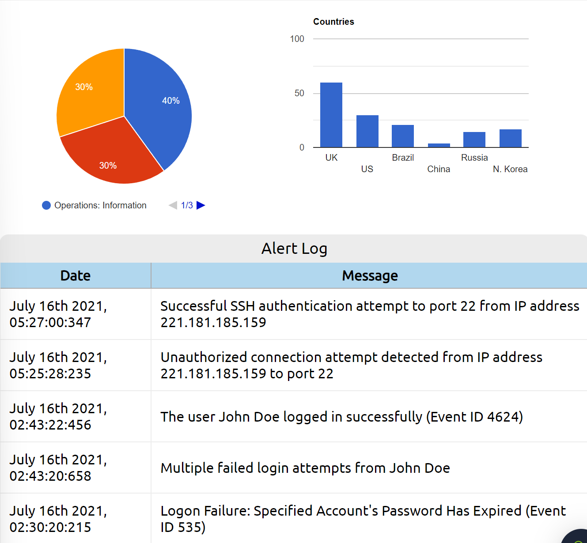
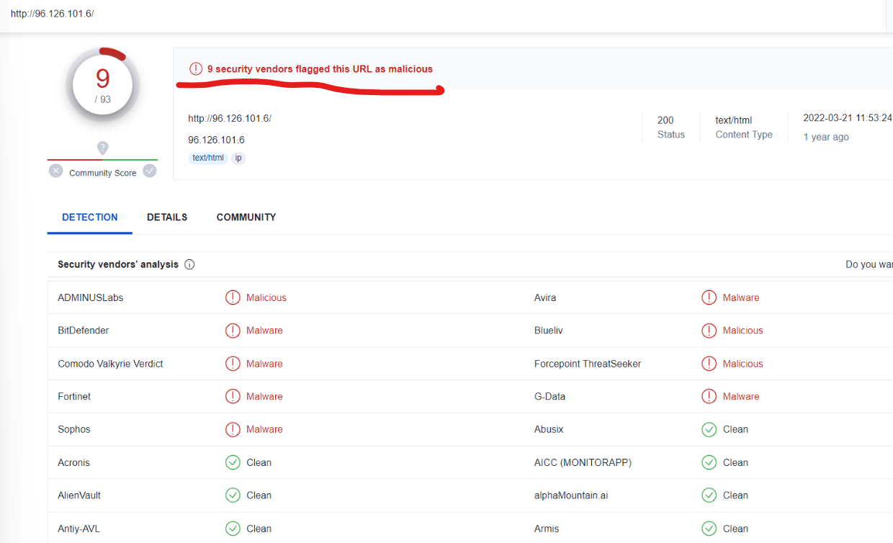

# Notes relevant to SOC tier 1 role

# Intro

## Responsibilities

- Monitor and investigate alerts
- conf and manage sec tools
- develop and implement basic IDS (Intrusion Detection System) signatures
- Participate in SOC working groups, meetings
- create tickets and escalater the sec incidents to tier 2 and if needed Team Lead

SOC tied model overview:

SOC investigates, monitors, prevents and responds to threats

**prevention methods** - gather data on threats, threat actors and their TTPs(Tactics, techniques and procedures) - Maintenance procedures: - updating firewall signatures - patching vulnerabilitie - block-listing/safe-listing applications, email addresses and IPs

**Monitoring and investigating** - SIEM(Security information and event management) - EDR (Endpoint Detection and Response) - integrated endpoint security solutions - monitors and collects endpoint data with rules-based automated response and analysis capabilitises - analyze data to identify threat patterns - Forensics and analysis tools to research identified threats and search for suspicious activities

**Response** - after investigating, SOC team coordinates and takes action on compromised hosts - isolating hosts from network - terminating malicious processes - deleting files - and more

### Tutorial 1

first tutorial from SOC path in tryhackme

firts goal is to detect the suspicious activity wich is clearly the unauthorized connection from IP: 221.181.185.159 to Port 22

we check the reputation of a ip address

ip seems to be mmalicious
next we ecalate it, as we noticed on the first part that it succesfully authenticated

**we escalate it to SOC team lead and got permission to block the ip address**

we add the ip to firewall blocklist and the first tutorial is completed

# Pyramid of pain

## Hash values

**Numeric value or a fixed length that uniquely identifies data** - result of a hashing algorithm

**MD5**
-NOT considered secure - 128-bit hash
**Sha-1(Secure Hash Algorithm 1)**

- 160-but hash
- 40 digit hexadecimal number
- Banned 2013 due its susceptivle to brute-force attacks
  **SHA-2**
- Many variants, most common is SHA-256
  - SHA-256 returns a hash value of 256-bits as a 64 digit hexadecimal number

A hash is not considered to be cryptographically secure if two files have the same hash value or digest.

security professionals usually use hash values to gain insights into a specif malware sample, a malicious or a suspicious file and as a wayt o identify and reference the malicious artifact.

researchers provide these hashed related to the malicious or suspicious files at the end of reports.

there a re many online tools to do hash lookups
[VirusTotal](https://www.virustotal.com/gui/)
[Metadefender Cloud- OPSWAT](https://metadefender.opswat.com/)

example:

With so many variations and instances of known malware or ransomware, threat hunting using file hashes as the IOC (Indicators of Compromise) can become difficult.

## IP Address

In pyramid of pain, ip addresses are indicated twith the color green

Most common defense tactic is to block, drop or deny inbound requests from IP addresses on your parameter or external firewall

- this is not very bulletproof, as its pretty easy for experienced adversary to gain a new public IP address

**Fast Flux**

- a DNS technique used by botnets to hide phishing, web proxying, malware delivery and malware communication activities behind compromised hosts acting as proxies.
- goal is to make communication between malware and its command and control server ahrd to discover.

#### Task

read a report and find asnwers to questions.
Malware analysis on file some_malicious_file.bin

Read the following report to answer this question. What is the first IP address the malicious process (PID 1632) attempts to communicate with?

Read the following report to answer this question. What is the first domain name the malicious process (PID 1632) attempts to communicate with?

Answers found on connections section of the report

## Domain Names

Domain Names can be thought as simply mapping an IP address to a string of text. A domain name can contain a domain and a top-level domain (evilcorp.com) or a sub-domain followed by a domain and top-level domain (tryhackme.evilcorp.com)

Many DNS providers have loose standards and provide APIs to make it easier for attackers to change domains

**PunyCode**

Punycode is a way of converting words that cannot be written in ASCII, into a Unicode ASCII encoding.

Url shorteners are used by attackeds to hide the macicious domains. It creates a short and unique URL that will redirect to the specific website specified during setting up the URL shortener link. Here are some URL shortening services used to generate malicious links:

- bit.ly
- goo.gl
- ow.ly
- s.id
- smarturl.it
- tiny.pl
- tinyurl.com
- x.co

You can see the actual website the shortened link is redirecting you to by appending "+" to it

so punycode attack uses unicode characters in the domain name to imitate a known domain

## Host Artifacts

Host artifacts are the traces or observables that attackers leave on the system, such as registry values, suspicious process execution, attack patterns or IOCs (Indicators of Compromise), files dropped by malicious applications, or anything exclusive to the current threat.

### Task

in this task we review a report from security vendors analysis on malicious sample

1:

2:

3:

## Network Artifacts

A network artifact can be a user-agent string, C2 information, or URI patterns followed by the HTTP POST requests.An attacker might use a User-Agent string that hasn’t been observed in your environment before or seems out of the ordinary. The User-Agent is defined by RFC2616 as the request-header field that contains the information about the user agent originating the request.

Network artifacts can be detected in Wireshark PCAPs (file that contains the packet data of a network) by using a network protocol analyzer such as TShark or exploring IDS (Intrusion Detection System) logging from a source such as Snort.

## Tools

attackers use macro documents (maldocs) for spearphishing attempts, a backdoor that can be used to establish C2 (Command and Control Infrastructure), any custom .EXE, and .DLL files, payloads, or password crackers.

Antivirus signatures, detection rules, and YARA rules can be great weapons for you to use against attackers at this stage.

MalwareBazaar and Malshare are good resources.

- provice access to samples
- malicious feeds
- YARA results

**detection rules**

- SOC Prime Threat DEtection Marketplace is a good platform for detection rules for different kinds of threats, including latest CVE's

**Fuzzy Hashing / context triggered piecewise hashes**

- helps to perform similarity analysis
- match two files with minor differences based on the fuzzy hash values.
- complete explanation : https://ssdeep-project.github.io/ssdeep/index.html
