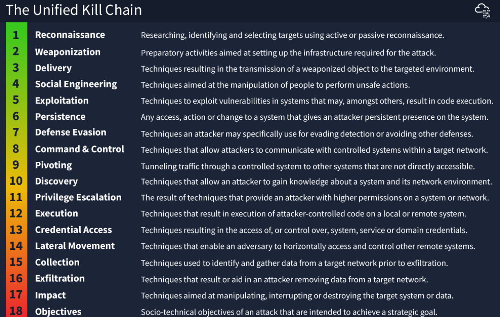
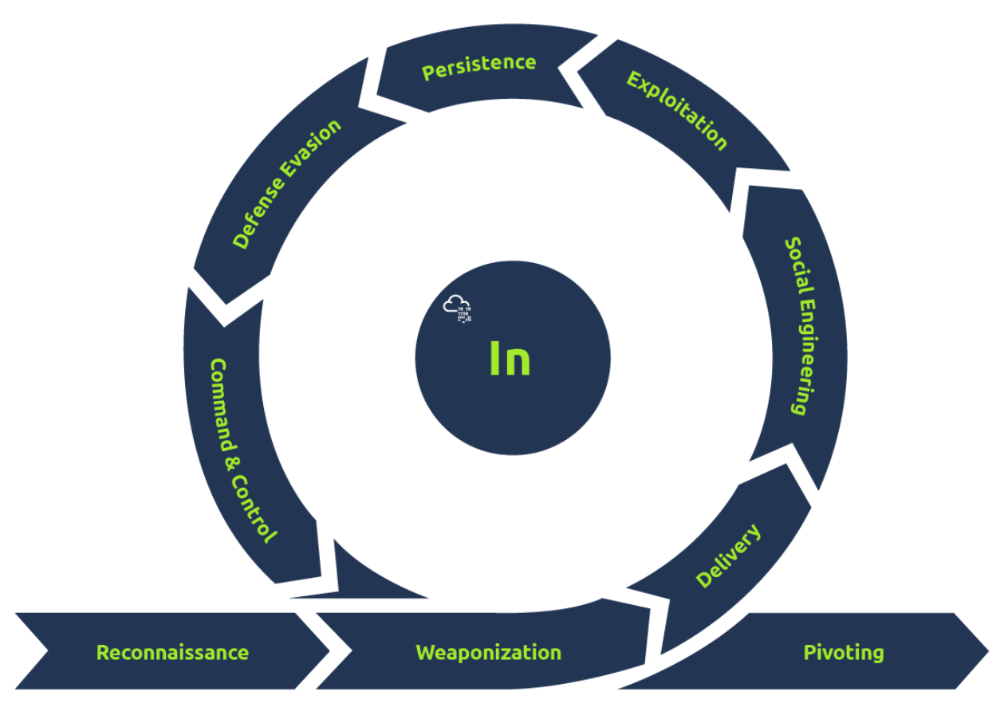
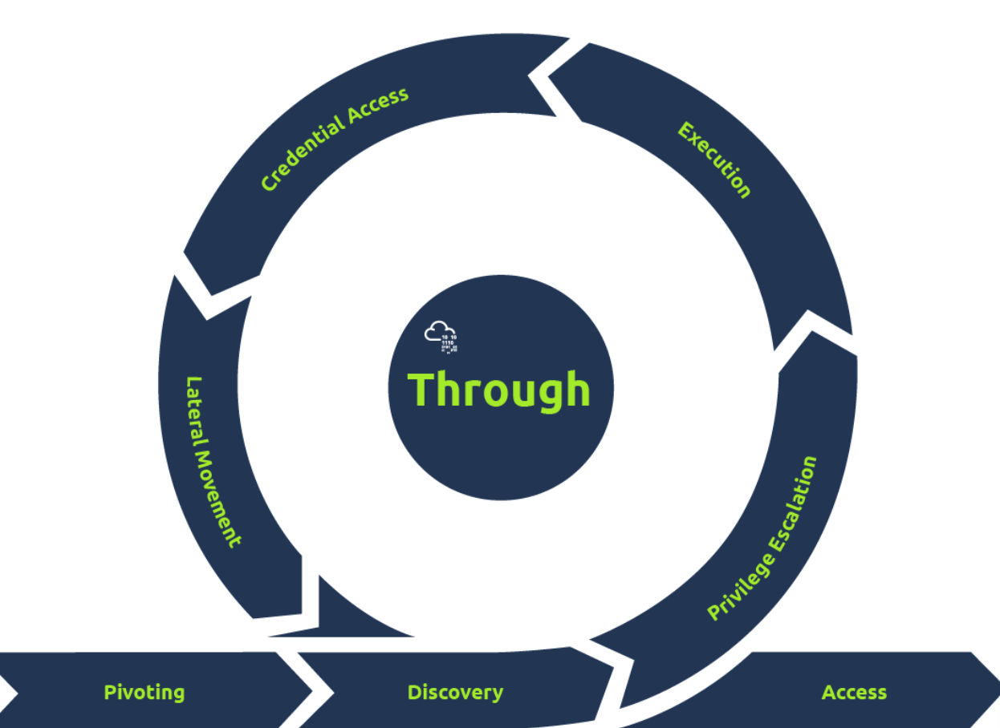

## This file contains notes from THM rooms considering topics: Unified Kill Chain, Diamond Model & MITRE

I did not collect a lot of notes during these rooms, as i was really focusing on the practical implementation of each topic. But i will post some notes from each to this, as its easier to come back and revisit the things learned during these rooms

## Unified Kill Chain. (UKC)

Unified kill chain is a framework wich establishes the phase of an attack, and a means of identifying and mitigating risk of IT assets

**Threat Modelling**

in cybsec, its a seruos of steps to improve security of a system - Identify systems and applications that need securing, and what functions they serve in the environment. - Asses what vulnerabilities and weaknesses these systems and applications may have and how they might be exploited - Create a plan of actions to secure these systems and applications from these vulnerabilities - Put in the policies to prevent these vulnerabilities from occuring again where possible. For example in soft dev life cycle for application or training employeed on phishing awareness

The UKC can encourage threat modelling as the UKC framework helps identify potential attack surfaces and how these systems may be exploited.

STRIDE, DREAD and CVSS (to name a few) are all frameworks specifically used in threat modelling.

## The UKC

Goal is to complement other kill chain frameworks such as Lockheed Martin’s and MITRE’s ATT&CK.

### these 18 steps can be split in to phases

**In (Initial Foothold)**
**Through(Network Propagation)**
**Out(Action on Objectives)**

THM has good visualization of each:

**In (Initial Foothold)**

**Through(Network Propagation)**

**Out(Action on Objectives)**
no picture for this but it consists of
**Collection**
**Exfiltration**
**Impact**
**Objetives**

# Diamond Model
